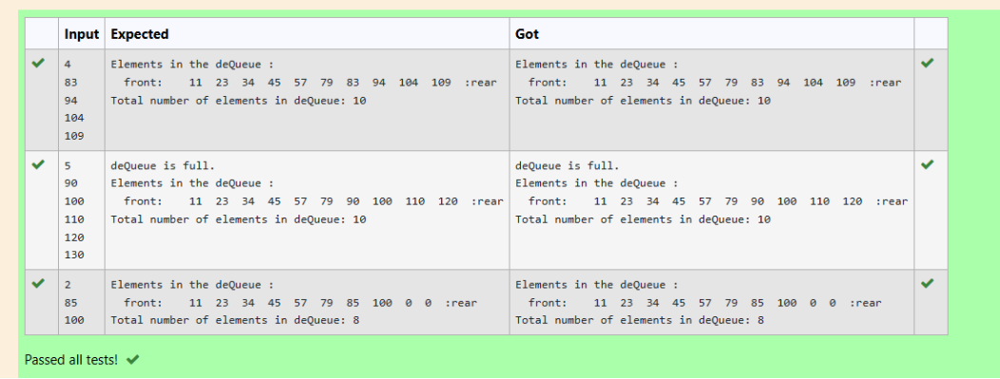

# Ex8 Deque
## DATE:
## AIM:
To write a C function to count the number of elements present in the deque.

## Algorithm
1. Start
2. Define a function count() that takes an array arr as input.
3. Initialize a counter c to track the number of non-zero elements.
4. Loop through the array from index 0 to MAX-1.
5. For each element, check if it's non-zero.
6. If the element is non-zero, increment the counter c.
7. Return the final count of non-zero elements in the array.
8. End   

## Program:
```
/*
Program to count the number of elements present in the deque
Developed by: PRIYAADARSHINI K
RegisterNumber:  212223240126
*/

#include <stdio.h>
#define MAX 10

void addFront(int *, int, int *, int *);
void addRear(int *, int, int *, int *);
int delFront(int *, int *, int *);
int delRear(int *, int *, int *);
void display(int *);
int count(int *);

int count(int *arr) {
  int c = 0, i;
  for(i=0;i<MAX;i++){
      if(arr[i]!='\0'){
          c++;
      }
  }
  return c;
}
```

## Output:



## Result:
Thus, the C code to count the number of elements present in the deque is implemented successfully.
